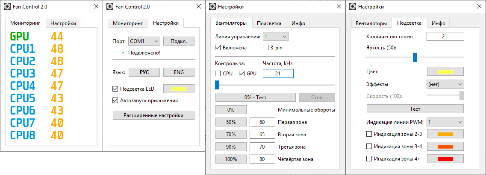

ESP32 Fan Control
===

О проекте:
---
**ESP32 Fan Control** - программа для управления корпусными вентиляторами и подсветкой посредством микроконтроллера ESP32.

Программа написана на **Python 3** с использованием **PyQt5**. Использует библиотеку **MSIAfterburner.NET.dll** от **Nick Сonnors**.
Требует для работы **MSI Afterburner** (Для получения информации о температурах).

 

**English version will be added soon**

Релизованые функции:
---
- Управление PWM 4 линиями в 6 температурных зонах
- Управление 3-pin вентиляторами с "холодным" стартом
- Управление 4-pin вентиляторами
- Плавное параллельное изменение оборотов
- Режим статической подсветки
- Режим динамической подсветки (Эффекты LED-ленты)
- Режим статической подсветки с индикацией температурных зон (С плавным изменением цвета)

В планах:
---
- Добавление возможности интеграции с системами умного дома

Технические требования:
---
- ESP32 DevKit на USB-UART конвертере CP2102. ESP должна быть прошита билдом MicroPython скомпиллированным с библиотекой machine_pwm от loboris.
- Подключение вентиляторов осуществляется с полной гальванической развязкой (реализуемо на недорогих модулях с PC817 c AliExpress, или более серьёзными изоляторами вроде HCPL2630/2631, ISO7240, ADUM1400)
- Поддерживается адресная LED-лента ws2811, ws2812b. Подключается от внешнего источника питания или с полной гальванической развязкой

**Более подробная информация будет доступна позже.**

Известные проблемы:
---
- Шумы на LED-ленте в динамических режимах работы
