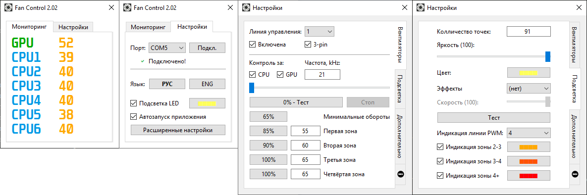

ESP32 Fan Control
===
**English version in the bottom of the page!**

О проекте:
---
**ESP32 Fan Control** - программа для управления корпусными вентиляторами и подсветкой посредством микроконтроллера ESP32.

Программа написана на **Python 3** с использованием **PyQt5**. Для извлечения информации о температурах использует библиотеку **OpenHardwareMonitorLib.dll** от **Michael Möller** или **MSIAfterburner.NET.dll** от **Nick Сonnors**, в случае использования последней требует для работы **MSI Afterburner**.

Релизованые функции:
---
- Управление PWM 4 линиями в 6 температурных зонах
- Управление 3-pin вентиляторами с "холодным" стартом
- Управление 4-pin вентиляторами
- Реализована возможность подключения ВРАЗРЕЗ штатных PWM линий
- Плавное параллельное изменение оборотов
- Режим статической подсветки
- Режим динамической подсветки (Эффекты LED-ленты)
- Режим статической подсветки с индикацией температурных зон (С плавным изменением цвета)

Материалы на других ресурсах:
---
- [Видео на YouTube (Полный гайд по релизной версии)](https://www.youtube.com/watch?v=hcDneHLOB7w "Видео на YouTube")

- [Статья на overclockers.ru (Полный гайд по релизной версии)](https://overclockers.ru/blog/ATRChannel/show/35068/esp32-fancontrol-reobas-s-funkciej-upravleniya-led-lentoj-svoimi-rukami "Статья на overclockers.ru")

- [Статья на alexgyver.ru](https://community.alexgyver.ru/threads/reobas-na-esp32-s-funkciej-upravlenija-3pin-4pin-adresnoj-svetodiodnoj-lentoj.2948/ "Статья на alexgyver.ru")

Технические требования:
---
- ESP32 DevKit на USB-UART конвертере CP2102. ESP должна быть прошита билдом MicroPython скомпиллированным с библиотекой machine_pwm от loboris.
- Подключение вентиляторов осуществляется с полной гальванической развязкой (реализуемо на недорогих модулях с PC817 c AliExpress, или более серьёзными изоляторами вроде HCPL2630/2631, ISO7240, ADUM1400)
- Поддерживается адресная LED-лента ws2812b, ws2811 (Для использования необходим конвертор логических уровней, разводка добавлена в RCB версии 1.2). Подключается от внешнего источника питания или с полной гальванической развязкой

Известные проблемы:
---
- Шумы на LED-ленте в динамических режимах работы

ChangeLog:
---
**v2.1/1.1**
- Программа переведена на работу "по дефолту" с OpenHardwareMonitorLib.dll от Michael Möller, и более не требует MSI Afterburner для запуска. Возможность работы с MSIAfterburner.NET.dll сохранена, соответствующая опция представленна в настройках.

**v2.03/1.1:**
- Добавлена возможность изменять время отсрочки автозапуска (При автоматическом запуске программы по стандарту используется отсрочка в 5 секунд, чтобы MSIAfterburner успел загрузиться). Может помочь на слабых машинах.
- Заблокирована возможность смены линии до завершения изменения оборотов вентилятора при тестировании.

**v2.02/1.1:**
- Добавлена возможность перезагружать устройство в сервисный режим для обеспечения удобства обслуживания и обновления. Кнопка перезагрузки в сервисный режим разместилась в "Дополнительно" окна Настроек. При нажатии в файловой системе устройства создаётся файл "service", при наличии которого, устройство НЕ будет загружать скрипт FanControl и позволит подключаться при помощи Espy. Для возобновления работы скрипта FanControl файл "service" необходимо удалить
- Добавлена возможность редактировать зону, в которой на 3-pin вентиляторы подаётся бустовый импульс, без внесения изменений в конфиг файл вручную: опция редактирования зоны буста для 3-pin вентиляторов разместилась во вкладке "Дополнительно" окна настроек.
- Переменные скрипта FanControl вынесены в отдельный файл config.py, редактировать и заменять основной файл boot.py теперь можно без потери и необходимости редактировать конфигурационные переменные. Так же, позволит в будущем реализовать возможность менять часть переменных из программы (уже реализована такая возможность с зоной буста 3-pin). ВНИМАНИЕ, при "пепреезде" с первой версии boot.py потребуется перенести свои настройки в config.py!
- Небольшой багфикс в основной программе, исправлен баг, при котором не отображалось лого ESP32 во вкладке "Инфо"
- Отредактирована схема RCB (Схема всё-ещё не проверена на практике!), для обеспечения безопасности PWM-линий матплаты на плату вразрез заборных линий PWM-сигнала добавлены диодыю, увеличено расстояние между отверстиями входных и выходных 4-pin разъёмов

Планы:
---
- Перевод основного приложения на .net/wpf с внесением неких изменений в работу скрипта аппаратной части
- Добавление возможности учёта показаний термопары (Возможность подключения термопары реализована в последней схеме RCB, поддержка в софте отсутствует!)
- Добавление возможности подключения дисплеев

---
**English version**

---

About:
---

**ESP32 Fan Control** - hardware based programm, what provides ability of control for case fans and led tapes.

Program is written on **Python 3** with using **PyQt5**. For temperatures information extraction it uses **OpenHardwareMonitorLib.dll** by **Michael Möller** or **MSIAfterburner.NET.dll** by **Nick Connors**,  in case of using last one also requires  **MSI Afterburner**.

Realized functions:
---
- Control of four PWM lines in six temperature zones
- Control of 3-pin fans with "cold launch" ability
- Control of 4-pin fans
- Smooth parallel RPM changing
- "Incut" mode, with it you can use default PWM signal from motherboard, when ESP32 FanControl program is not launched (is not fully finished yet, but can be used)
- Static led light
- Dynamycal led light (Some led-effects)
- Static led light with coloured temperature zones indication (With smooth colour changing)

Technical requirements:
---
- ESP32 DevKit with CP2102 USB-UART convertor. ESP must be flashed with custom uP with integrated PWM module of Loboris (my build you can find in the repo)
- Fans must be connected with full galvanic isolation (it can be realized on cheap PC817 modules from aliexpress, or, in the case of handmade RCB, you can use isolator such as ADUM1400 or HCPL2630/2631)
- Supported adress LED-tape: ws2812b, and, must be ws2811 (not tested yet. To support, levels switcher 3.3->5v need to be added to led signal line). You can power about 15 leds from USB 3.0, or use outer source of power.

Short HOWTO:
---
Defaul frequencies for PWM fan controling are about 21kHz.
In \scheme folder, you can find two schemas:
- A simple one, on cheap components, called "simple-cheme.bmp". PC817 deform PWM signal, so, with such kind of realization, you need to use as low PWM frequency signal, as it can be. You can use any frequencies for 4-pin PWM control, 4-pin fans will work even with 100hz signul, but i recommend something about 5kHz. For control 3-pin fans via n-fet, you need to choose the maximum low frequency, with wich the fan won't whistle, usualy it about 12-17kHz.

- And also RCB scheme for SprintLayout for making handmade RCB. You can convert it to gerber and order on services like RCBWay, or make it yourself with etching technologies. Nominales of components you can find on the scheme mask. ADUM1400 is very fast, so, you can use any frequencies as you wish, i recommend using default 21kHz. Also, this scheme realizes "incut" mode, and has two logic chips for it. The last RCB scheme is not tested on practic yet! Check it before realization!

**Few words about settins:**

- The rpm control rage of 3-pin fans can be different, the bottom RPM border can be by 10% of PWM-filling to 60-70%, its okay. You can choose the boost zone of 3-pin fans: its the zone, where 3-pin fan gets short boost to 100% duty by cold start. By default - its 50%. For example, if your fan minimal RPM is 40% - to start it FanControl will send 100% duty impulce for 0.05s, and then will change PWM duty for 40%. For my case fans minimal RPM pwm is 60%, so, i changed boost zone for 80%. You can change it from settings window of program, in "additional" tab
- You can find and define settings of used pins in config.py. You must check and change in need next params: as_pin (autostart pin, need to be connected with ground for ESP32 script launch), PWM_Pins (pins of main PWM lines), EXT_Pins (extencion pins for "incut" mode, each pin must match with its PWM_line pin connection to logic chips), led_pin (pin where LED-tape connected in), led_relay (pin where connected relay controlling power of LED-tape). Its better not to change another settings.

**If will be any questions, i will try to write more complete guide**

Known issues:
---
- Some noizes on LED-tape in dynamic modes

ChangeLog:
---
**v2.1/1.1**
-Default source lib is changed from MSIAfterburner.NET.dll to OpenHardwareMonitorLib.dll by Michael Möller. FanControl now is not need MSIAfterburner to work, but ability of work with MSI Afterburner as source lib is saved.

**v2.03/1.1:**
- Added ability to change application autoload delay (Application is loading with windows by default with 5sec delay to give some time for MSIAfterberner to be launched)
- Ability of line change while fan is changing its speed in testing mode is blocked.

**v2.02/1.1:**
- Added 'Service mode' to provide easyeler maintenance and flashing. After entering service mode device creating "service" file in its file system. You need to remove "service" for connect to device with ESP32 FanControl again.
- Added ability to change 3-pin fans boost zone. Its now in "Additional" tab of "Additionals" window.
- Users variables of boot.py script are now in config.py to provide easyeler update to new versions of boot.py.
- Some small bugfixes in main programm.
- RCB scheme is changed (still wasnt checked on practice!) to provide safeness of motherboard PWM-lines
---

Next steps:
---
- Main program migration to .net/wpf with some changes in hardware script
- Adding ability of using thermocouple data (thermocouple controller already added to RCB scheme v1.2)
- Adding ability of display connection
