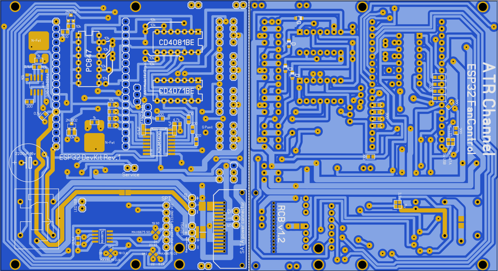

статус:
---
RCB_1.02.lay6: не проверена, требуется проверка
RCB_1.2.lay6: не проверена, требуется проверка

 changelog:
 ---
 **v1.01**:
 -Увеличено расстояние между входными и выходными отверстиями 4-pin
 -Надписи задней стороны RCB отзеркалены
 -Сдвинут конденсатор для обеспечения доступа ко второму разъёму 3-pin
 -Добавлены диоды на входные PWM-линии для обеспечения безопасности матплаты
 
 **v1.02**:
 -Исправлено пересечение дорожек в районе логических микросхем
 
 **v1.2**:
 -Плата увеличена в размерах для рамещения в салазках 3.5-дюймовых HDD
 -Реализована "гибкая разводка", для реализации различных схем подключения питаний и сигнальных линий.
 -Введена плата расширения для размещения всех разъёмов на лицевой панели
 -Добавлен конвертор логических уровней на линию сигнала LED для подключения светодиодных лент WS2811
 -Добавлен контроллер MAX6675/MAX31855 для добавления в будущем возможности подключения термопары
 -Разведена SPI-шина, для добавления в будущем возможности подключения дисплея
 -Добавлена разводка для распайки SATA-разъёма
 -Разводка перевёрстана для безпроблемной конвертации в gerber и отправки на печать
 
 